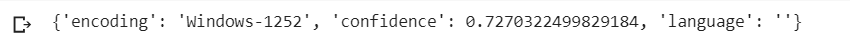
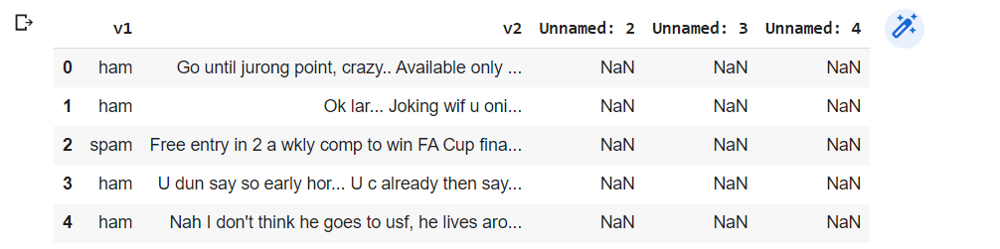
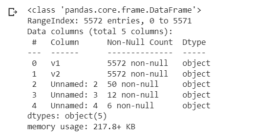
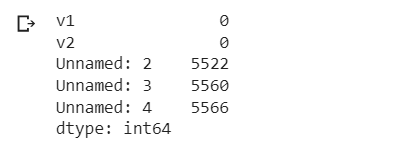
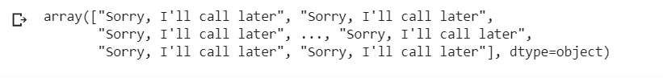
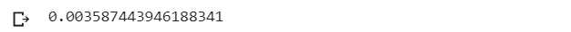

# Implementation-of-SVM-For-Spam-Mail-Detection

## AIM:
To write a program to implement the SVM For Spam Mail Detection.

## Equipments Required:
1. Hardware – PCs
2. Anaconda – Python 3.7 Installation / Jupyter notebook

## Algorithm
-Collect a labeled dataset of emails, distinguishing between spam and non-spam.

-Preprocess the email data by removing unnecessary characters, converting to lowercase, removing stop words, and performing stemming or lemmatization.

-Extract features from the preprocessed text using techniques like Bag-of-Words or TF-IDF.

-Split the dataset into a training set and a test set.

-Train an SVM model using the training set, selecting the appropriate kernel function and hyperparameters.

-Evaluate the trained model using the test set, considering metrics such as accuracy, precision, recall, and F1 score.

-Optimize the model's performance by tuning its hyperparameters through techniques like grid search or random search.

-Deploy the trained and fine-tuned model for real-world use, integrating it into an email server or application.

-Monitor the model's performance and periodically update it with new data or adjust hyperparameters as needed.

## Program:

Program to implement the SVM For Spam Mail Detection.

Developed by: NITEESH M

RegisterNumber:  212222230098
````
import chardet
file='/content/spam.csv'
with open(file,'rb') as rawdata:
  result = chardet.detect(rawdata.read(100000))
result

import pandas as pd
data=pd.read_csv('/content/spam.csv',encoding='Windows-1252')

data.head()

data.info()

data.isnull().sum()

x=data["v1"].values
y=data["v2"].values

from sklearn.model_selection import train_test_split
x_train,x_test,y_train,y_test=train_test_split(x,y,test_size=0.2,random_state=0)

from sklearn.feature_extraction.text import CountVectorizer
cv=CountVectorizer()

x_train=cv.fit_transform(x_train)
x_test=cv.transform(x_test)

from sklearn.svm import SVC
svc=SVC()
svc.fit(x_train,y_train)
y_pred=svc.predict(x_test)
y_pred

from sklearn import metrics
accuracy=metrics.accuracy_score(y_test,y_pred)
accuracy
````

## Output:
### 1. Result output


### 2. data.head() 


### 3. data.info()


### 4. data.isnull().sum()


### 5. Y_prediction value


### 6. Accuracy value


## Result:
Thus the program to implement the SVM For Spam Mail Detection is written and verified using python programming.
